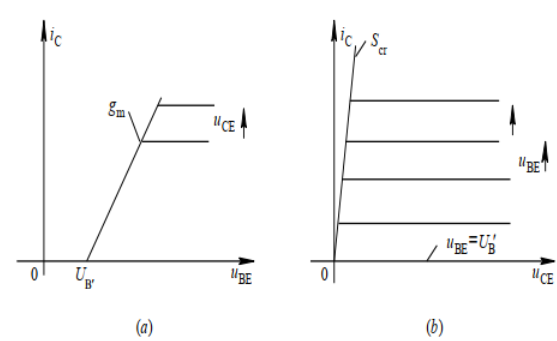

# 通信电子线路
> 用于保研复习
## 第一章 绪论

### 1.1 电子线路与频段
#### 一、频段划分

|  |  |
| ------------------------------------------------------------ | ------------------------------------------------------------ |

#### 二、线性与非线性电子线路

> 什么是线性特性？叠加性和均匀性，适用叠加定理

**线性元件与非线性元件**

线性元件：元件的特性曲线表现为直线，其特点在于元件的参数与通过其上的电压或者电流无关(RLC)

非线性元件：元件的特性曲线不是直线，其特点在于元件的参数与通过其上的电压或者电路有关(二极管、变容二极管等等)

**非线性电子线路和线性电子线路的5条不同**

1. 非线性电子线路不具有叠加性和均匀性，不适用于叠加定理
2. 在稳定状态下，非线性电子线路输出中含有输入变量中不含有的频率成分(用于频率变换，如倍频等等)
3. 处于非线性工作的有源器件，输出的响应与工作点的选取和输入信号的大小有关
4. 静态参量(直流分析参量)，动态参量(交流分析，频率变换电路分析)，折合参量(平均参量，适用于PA和OC的分析)
5. 非线性电子线路的数学描述(非线性方程)没有很精确的求解方法，在工程上通常沿用近似解法

### 1.2 通信系统架构与一些概念

发送设备：将基带信号变换成适合信道传输的信号

信道：传输媒质，包括有线(双绞线、同轴电缆、光纤)和无线(自由空间)

接收设备：接收传送过来的信号，并进行处理，以恢复发送端的基带信号

调制：

1. 定义：正弦波的三个参数(幅度频率和相位)中某一个随调制信号大小而线性变化的过程，分别成为幅度调制、频率调制和相位调制

2. 原因：①利用高频载波减小天线的尺寸；②选台，将不同信息分配到不同频率的载波信号上，使接收机可以收到特定的信息并抑制其他的干扰；③多路复用

解调：在接收信号的一方（接收端），从收到的已调信号中把调制信号恢复出来。 调幅波的解调叫“检波” ，调频波的解调叫“鉴频” ，解调是其统称。  

## 第二章 高频功率放大器

### 2.1 谐振功率放大器的基本原理

#### 一、概述

1. 定义：高频功率放大器是一种能量转换器件，是将电源供给的直流能量转换为高频交流输出；作用是放大信号，使之达到足够功率输出，满足天线发射或者其他负载的需求。
2. 特点：①输入信号强，电压在几百mV到几V的数量级；②为了提高放大器的工作效率，通常工作在丙类，即晶体管工作延伸到非线性区域(饱和区和截止区)；③要求输出功率大，效率高。

#### 二、基本工作原理

**电路组成**

|  |  |
| ------------------------------------------------------------ | ------------------------------------------------------------ |

$E_B$是基极偏置电压，调整$E_B$可以改变放大器的工作类型

$E_C$是集电极电源电压

集电极外接$LC$并联振荡回路的功用是作为放大器负载，选频

​	设输入电压为一个余弦电压，即
$$
u_b=U_{bm}cos(\omega t)
$$
​	则管子基极、发射极电压$U_{BE}$为
$$
u_{BE}=E_B+u_b=E_B+U_{bm}cos\omega t
$$
​	在处于丙类工作状态的时候，$E_B<U'_B$，在这种偏置条件下，集电极电路$i_c$为余弦脉冲(存在高次谐波)，其最大值为$i_{cmax}$，电流流通的相角为$2\theta$，通常称为集电极电流的导通角，丙类工作时，$\theta<\pi/2$。利用并联谐振回路的选频滤波作用，震荡回路两端的电压可近似认为只有基波电压，即
$$
u_b=U_{bm}cos(\omega t)=I_{c1m}R_ecos(\omega t)
$$
**电路参量之间的时间关系**

|  | 虽然集电极电流为脉冲， 但由于LC并联谐振回路的选频滤波作用， 集电极电压仍为余弦波形， 且  $u_{CE}$和$u_{BE}$反相 |
| ------------------------------------------------------------ | ------------------------------------------------------------ |

​	如果将LC振荡回路调谐到n次谐波上，则回路两端的频率是激励信号频率的n倍，即为**倍频器**。

#### 三、倍频器

|  |  |
| ------------------------------------------------------------ | ------------------------------------------------------------ |

#### 四、高频谐振功率放大器中的能量关系

1. 原理电路回顾

2. 物理量与公式

|            物理量             |                             公式                             |
| :---------------------------: | :----------------------------------------------------------: |
|     LC振荡回路的高频功率      | $P_o=\frac{1}{2}I_{c1m}U_{cm}=\frac{1}{2}I_{c1m}^2R_e=\frac{1}{2}\frac{U_{cm}^2}{R_e}$ |
| 集电极电源$E_C$的直流输入功率 |                       $P_E=E_CI_{C0}$                        |
|        集电极耗散功率         |                        $P_C=P_E-P_O$                         |
|          集电极效率           | $\eta_c=\frac{P_o}{P_E}=\frac{1}{2}\frac{I_{c1m}U_{cm}}{I_{c0}E_C}$ $\eta_c=\frac{1}{2}g_1(\theta)\xi$ |
|           波形系数            |                 $g_1(\theta)=I_{c1m}/I_{c0}$                 |
|      集电极电压利用系数       |                     $\xi=U_{cm}/I_{c0}$                      |

​	功放的效率主要由集电极电流决定，集电极电流越大，耗散功率越大，功放效率越小。提高工作效率，就要减少集电极导通时间，因此应该工作在C类，功放效率更高

### 2.2 丙类谐振功率放大器的工作状态分析

#### 一、解析分析法

**晶体管外部电压方程**非常重要
$$
\begin{cases}u_{BE}=E_B+U_{bm}cos\omega t ①\newline
u_{CE}=E_C-U_{cm}cos\omega t②
\end{cases}
$$

|  | 放大区：$i_c=g_m(u_{BE}-U'_B),u_{BE}\geq U'_B$ 截止区：$i_c=0,u_{BE}<U'_B$ 由图B中可以看出 饱和区：$i_C=S_{cr}u_{CE}$ |
| ------------------------------------------------------------ | ------------------------------------------------------------ |

**导通角求法**
$$
cos\theta = \frac{U'_B-E_B}{U_{bm}}\newline
cos\theta = \frac{E_C-U_{CE}}{U_{cm}}=\frac{E_C-E_C'}{U_{cm}},-\theta\leq \omega t\leq\theta
$$

**解析分析**
$$
i_C=g_m(E_B+U_{bm}\cos\omega t-U_B^{\prime})
$$

当$\omega t=\theta$时，$i_c=0$，则有

$$
cos\theta = \frac{U'_B-E_B}{U_{bm}}
$$

当$\omega t=0$时，$i_c=i_{cmax}$，则有

$$
\begin{aligned}i_{C}&=i_{C\max}=g_{m}(E_{B}+U_{bm}-U_{B}^{\prime})\\&=g_{m}U_{bm}(1-\cos\theta)\end{aligned}
$$

将上式的两个等式变形可以得到

$$
g_m=\frac{i_{cmax}}{U_{bm}(1-cos\theta)}
$$

$$
U_B^{\prime}=U_{bm}\cos\theta+E_B
$$

带入最上面的$i_C$的式子，可以得到
$$
i_{C}=i_{C\max}\frac{\cos\omega t-\cos\theta}{1-\cos\theta},-\theta\leq\omega t\leq\theta
$$
则，
$$
I_{C0}=\frac{1}{2\pi}\int_{-\theta}^{\theta}i_{C}d\omega t=i_{C\max}\frac{\sin\theta-\theta\cos\theta}{\pi(1-\cos\theta)}=i_{C\max}a_{0}(\theta)
$$

基波分量幅值为

$$
I_{c1m}=\frac{1}{\pi}\int_{-\theta}^{\theta}i_{C}\cos\omega td\omega t=i_{C\max}\frac{2\theta-\sin2\theta}{\pi(1-\cos\theta)}=i_{C\max}a_{1}(\theta)
$$

​	对于余弦脉冲分解系数$\alpha_n(\theta)$，谐波次数越高，其幅值越小，对于某一次谐波而言，总有一个$\theta$值，可以使振幅达到最大值。

#### 二、动特性曲线分析法

> 利用参数变化时，负载线的斜率、位置与斜率大小都会发生变化，即为动态特性。

**外部电压方程**

当放大器工作于谐振状态时，外部特征方程
$$
\begin{cases}u_{BE}=E_B+U_{bm}cos\omega t ①\newline
u_{CE}=E_C-U_{cm}cos\omega t②
\end{cases}
$$
在转移特性的放大区，内部特性方程

$$
i_C=g_m(u_{BE}-U'_B),u_{BE}\geq U'_B
$$

**CAD折线法**

|  | 1. 取$\omega t=0$，求出C点 $u_{BE}=E_B+U_{bm}=U_{BEmax} \ \   u_{CE}=E_C-U_{cm}=U_{CEmin}$ 2.取$\omega t=\pi/2$，求出B点 $u_{BE}=E_B \ \  u_{CE}=E_C$ 3.取$\omega t=\pi$，求出D点 $u_{BE}=E_B-U_{bm} \ \  u_{CE}=E_C+U_{cm}$  |
| ------------------------------------------------------------ | ------------------------------------------------------------ |

​	实际上，三个点的坐标可以表示为
$$
C(U_{CEmin},U_{BEmax})\ \ B(E_C,E_B)\ \ D(E_C+U_{cm}，E_B-U_{bm})
$$

#### 三、调谐功放的三种工作状态

**三种工作状态**

1. 欠压——晶体管的大部分时刻都工作在放大状态
2. 临界——刚刚进入饱和区边缘
3. 过压——晶体管工作时有部分时间进入饱和区

​	功放的工作状态由$E_C,E_B,U_{cm},U_{bm}$四个参量决定。

**判断方法**

|  | C:欠压 C':临界 E：过压(映射到F点和C点上) |
| ------------------------------------------------------------ | ---------------------------------------------- |

#### 四、负载特性分析

> 负载特性是指当保持$E_C,E_B,U_{bm},U_{cm}$不变，而改变$R_e$时，谐振功放的电流电压输出功率等等随之变化的曲线。

$R_e$由小到大，工作状态由欠压变为临界再进入过压。相应的集电极电流由余弦脉冲变为凹陷脉冲。

​	一般谐振功率放大器要得到大功率、高效率的输出，应该工作在临界或者弱过压状态。
