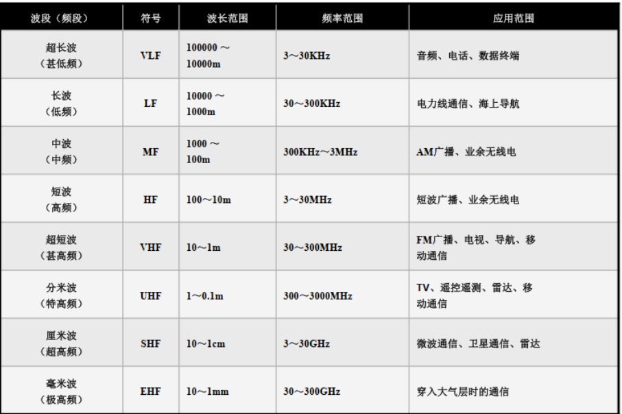

# 通信电子线路
> 用于保研复习
## 第一章 绪论

### 1.1 电子线路与频段
#### 一、频段划分

|  |  |
| ------------------------------------------------------------ | ------------------------------------------------------------ |

#### 二、线性与非线性电子线路

> 什么是线性特性？叠加性和均匀性，适用叠加定理

**线性元件与非线性元件**

线性元件：元件的特性曲线表现为直线，其特点在于元件的参数与通过其上的电压或者电流无关(RLC)

非线性元件：元件的特性曲线不是直线，其特点在于元件的参数与通过其上的电压或者电路有关(二极管、变容二极管等等)

**非线性电子线路和线性电子线路的5条不同**

1. 非线性电子线路不具有叠加性和均匀性，不适用于叠加定理
2. 在稳定状态下，非线性电子线路输出中含有输入变量中不含有的频率成分(用于频率变换，如倍频等等)
3. 处于非线性工作的有源器件，输出的响应与工作点的选取和输入信号的大小有关
4. 静态参量(直流分析参量)，动态参量(交流分析，频率变换电路分析)，折合参量(平均参量，适用于PA和OC的分析)
5. 非线性电子线路的数学描述(非线性方程)没有很精确的求解方法，在工程上通常沿用近似解法

### 1.2 通信系统架构与一些概念

发送设备：将基带信号变换成适合信道传输的信号

信道：传输媒质，包括有线(双绞线、同轴电缆、光纤)和无线(自由空间)

接收设备：接收传送过来的信号，并进行处理，以恢复发送端的基带信号

调制：

1. 定义：正弦波的三个参数(幅度频率和相位)中某一个随调制信号大小而线性变化的过程，分别成为幅度调制、频率调制和相位调制

2. 原因：①利用高频载波减小天线的尺寸；②选台，将不同信息分配到不同频率的载波信号上，使接收机可以收到特定的信息并抑制其他的干扰；③多路复用

解调：在接收信号的一方（接收端），从收到的已调信号中把调制信号恢复出来。 调幅波的解调叫“检波” ，调频波的解调叫“鉴频” ，解调是其统称。  

## 第二章 高频功率放大器

### 2.1 谐振功率放大器的基本原理

#### 一、概述

1. 定义：高频功率放大器是一种能量转换器件，是将电源供给的直流能量转换为高频交流输出；作用是放大信号，使之达到足够功率输出，满足天线发射或者其他负载的需求。
2. 特点：①输入信号强，电压在几百mV到几V的数量级；②为了提高放大器的工作效率，通常工作在丙类，即晶体管工作延伸到非线性区域(饱和区和截止区)；③要求输出功率大，效率高。

#### 二、基本工作原理

**电路组成**

|  |  |
| ------------------------------------------------------------ | ------------------------------------------------------------ |

$E_B$是基极偏置电压，调整$E_B$可以改变放大器的工作类型

$E_C$是集电极电源电压

集电极外接$LC$并联振荡回路的功用是作为放大器负载，选频

​	设输入电压为一个余弦电压，即
$$
u_b=U_{bm}cos(\omega t)
$$
​	则管子基极、发射极电压$U_{BE}$为
$$
u_{BE}=E_B+u_b=E_B+U_{bm}cos\omega t
$$
​	在处于丙类工作状态的时候，$E_B<U'_B$，在这种偏置条件下，集电极电路$i_c$为余弦脉冲(存在高次谐波)，其最大值为$i_{cmax}$，电流流通的相角为$2\theta$，通常称为集电极电流的导通角，丙类工作时，$\theta<\pi/2$。利用并联谐振回路的选频滤波作用，震荡回路两端的电压可近似认为只有基波电压，即
$$
u_b=U_{bm}cos(\omega t)=I_{c1m}R_ecos(\omega t)
$$
**电路参量之间的时间关系**

|  | 虽然集电极电流为脉冲， 但由于LC并联谐振回路的选频滤波作用， 集电极电压仍为余弦波形， 且  $u_{CE}$和$u_{BE}$反相 |
| ------------------------------------------------------------ | ------------------------------------------------------------ |

​	如果将LC振荡回路调谐到n次谐波上，则回路两端的频率是激励信号频率的n倍，即为**倍频器**。

#### 三、倍频器

|  |  |
| ------------------------------------------------------------ | ------------------------------------------------------------ |

#### 四、高频谐振功率放大器中的能量关系

1. 原理电路回顾

2. 物理量与公式

|            物理量             |                             公式                             |
| :---------------------------: | :----------------------------------------------------------: |
|     LC振荡回路的高频功率      | $P_o=\frac{1}{2}I_{c1m}U_{cm}=\frac{1}{2}I_{c1m}^2R_e=\frac{1}{2}\frac{U_{cm}^2}{R_e}$ |
| 集电极电源$E_C$的直流输入功率 |                       $P_E=E_CI_{C0}$                        |
|        集电极耗散功率         |                        $P_C=P_E-P_O$                         |
|          集电极效率           | $\eta_c=\frac{P_o}{P_E}=\frac{1}{2}\frac{I_{c1m}U_{cm}}{I_{c0}E_C}$ $\eta_c=\frac{1}{2}g_1(\theta)\xi$ |
|           波形系数            |                 $g_1(\theta)=I_{c1m}/I_{c0}$                 |
|      集电极电压利用系数       |                     $\xi=U_{cm}/I_{c0}$                      |

​	功放的效率主要由集电极电流决定，集电极电流越大，耗散功率越大，功放效率越小。提高工作效率，就要减少集电极导通时间，因此应该工作在C类，功放效率更高

### 2.2 丙类谐振功率放大器的工作状态分析

#### 一、解析分析法

**晶体管外部电压方程**非常重要
$$
\begin{cases}u_{BE}=E_B+U_{bm}cos\omega t ①\newline
u_{CE}=E_C-U_{cm}cos\omega t②
\end{cases}
$$

|  | 放大区：$i_c=g_m(u_{BE}-U'_B),u_{BE}\geq U'_B$ 截止区：$i_c=0,u_{BE}<U'_B$ 由图B中可以看出 饱和区：$i_C=S_{cr}u_{CE}$ |
| ------------------------------------------------------------ | ------------------------------------------------------------ |

**导通角求法**
$$
cos\theta = \frac{U'_B-E_B}{U_{bm}}\newline
cos\theta = \frac{E_C-U_{CE}}{U_{cm}}=\frac{E_C-E_C'}{U_{cm}},-\theta\leq \omega t\leq\theta
$$

**解析分析**
$$
i_C=g_m(E_B+U_{bm}\cos\omega t-U_B^{\prime})
$$

当$\omega t=\theta$时，$i_c=0$，则有

$$
cos\theta = \frac{U'_B-E_B}{U_{bm}}
$$

当$\omega t=0$时，$i_c=i_{cmax}$，则有

$$
\begin{aligned}i_{C}&=i_{C\max}=g_{m}(E_{B}+U_{bm}-U_{B}^{\prime})\\&=g_{m}U_{bm}(1-\cos\theta)\end{aligned}
$$

将上式的两个等式变形可以得到

$$
g_m=\frac{i_{cmax}}{U_{bm}(1-cos\theta)}
$$

$$
U_B^{\prime}=U_{bm}\cos\theta+E_B
$$

带入最上面的$i_C$的式子，可以得到
$$
i_{C}=i_{C\max}\frac{\cos\omega t-\cos\theta}{1-\cos\theta},-\theta\leq\omega t\leq\theta
$$
则，
$$
I_{C0}=\frac{1}{2\pi}\int_{-\theta}^{\theta}i_{C}d\omega t=i_{C\max}\frac{\sin\theta-\theta\cos\theta}{\pi(1-\cos\theta)}=i_{C\max}a_{0}(\theta)
$$

基波分量幅值为

$$
I_{c1m}=\frac{1}{\pi}\int_{-\theta}^{\theta}i_{C}\cos\omega td\omega t=i_{C\max}\frac{2\theta-\sin2\theta}{\pi(1-\cos\theta)}=i_{C\max}a_{1}(\theta)
$$

​	对于余弦脉冲分解系数$\alpha_n(\theta)$，谐波次数越高，其幅值越小，对于某一次谐波而言，总有一个$\theta$值，可以使振幅达到最大值。

#### 二、动特性曲线分析法

> 利用参数变化时，负载线的斜率、位置与斜率大小都会发生变化，即为动态特性。

**外部电压方程**

当放大器工作于谐振状态时，外部特征方程
$$
\begin{cases}u_{BE}=E_B+U_{bm}cos\omega t ①\newline
u_{CE}=E_C-U_{cm}cos\omega t②
\end{cases}
$$
在转移特性的放大区，内部特性方程

$$
i_C=g_m(u_{BE}-U'_B),u_{BE}\geq U'_B
$$

**CAD折线法**

|  | 1. 取$\omega t=0$，求出C点 $u_{BE}=E_B+U_{bm}=U_{BEmax} \ \   u_{CE}=E_C-U_{cm}=U_{CEmin}$ 2.取$\omega t=\pi/2$，求出B点 $u_{BE}=E_B \ \  u_{CE}=E_C$ 3.取$\omega t=\pi$，求出D点 $u_{BE}=E_B-U_{bm} \ \  u_{CE}=E_C+U_{cm}$  |
| ------------------------------------------------------------ | ------------------------------------------------------------ |

​	实际上，三个点的坐标可以表示为
$$
C(U_{CEmin},U_{BEmax})\ \ B(E_C,E_B)\ \ D(E_C+U_{cm}，E_B-U_{bm})
$$

#### 三、调谐功放的三种工作状态

**三种工作状态**

1. 欠压——晶体管的大部分时刻都工作在放大状态
2. 临界——刚刚进入饱和区边缘
3. 过压——晶体管工作时有部分时间进入饱和区

​	功放的工作状态由$E_C,E_B,U_{cm},U_{bm}$四个参量决定。

**判断方法**

|  | C:欠压 C':临界 E：过压(映射到F点和C点上) |
| ------------------------------------------------------------ | ---------------------------------------------- |

#### 四、高频特性分析

**负载特性分析$E_c、E_b、U_{bm}$不变，$R_e$变化时)**

$R_e$由小到大，工作状态由欠压变为临界再进入过压。相应的集电极电流由余弦脉冲变为凹陷脉冲。

​	一般谐振功率放大器要得到大功率、高效率的输出，应该工作在临界或者弱过压状态。

**集电极调制特性($E_B,U_{bm},R_e$不变而改变$E_C$)**

|  | 随着$E_C$的增加，高频功放由饱和向放大和欠压移动 在过压区域，输出电压幅度$U_{cm}$与$E_C$成正比， 利用这一特点，可以实现电压电流和功率的相应变化 这种功能成为集电极调幅。 |
| ------------------------------------------------------------ | ------------------------------------------------------------ |

**基极调制特性($E_C,U_{bm},R_e$保持不变而改变$E_B$)**

|  | 随着$E_B$的增加，高频功放从欠压到临界到过压移动 在欠压区域，集电极电压幅度$U_{cm}$与$E_B$基本成正比， 利用这一特点，可以通过控制$E_B$实现对电流电压功率的控制 这种工作方式称为基极调制。 |
| ------------------------------------------------------------ | ------------------------------------------------------------ |

**放大特性($E_c,E_B,R_e$而改变$U_{bm}$)**

|  | 随着$U_{bm}$的增加，高频功放从欠压到临界到过压移动 $U_{bm}$变化对谐振功放性能的影响与基极调制特性相似 |
| ------------------------------------------------------------ | ------------------------------------------------------------ |

**谐振功放的作用**

1. 当谐振功放作为线性功放的时候，放大器必须在$U_{bm}$的变化范围内工作在欠压状态
2. 当谐振功放作为振幅限幅器时，放大器必须在$U_{bm}$的变化范围内工作在过压状态，或者$U_{bm}$的最小值远大于临界状态的限幅门限电压

### 2.3 谐振功放电路

#### 一、馈电原则

1. 集电极馈电电路

|  | 1.保证集电极电流中的直流分量只流过集电极直流电源  2.谐振回路两端只有基波分量压降，可以把变换后的功率传回回路负载  3.保证外电路对高次谐波分量呈现短路，以免产生附加损耗 |
| ------------------------------------------------------------ | ------------------------------------------------------------ |

2. 基极馈电线路

|  | 1.基极电流中的直流分量直流过基极偏置电源 2.基极电路中的基波分量直流过输入端的激励信号源 |
| ------------------------------------------------------------ | ------------------------------------------------------------ |

#### 二、串馈与并馈

1. 集电极馈电线路

| 馈电方式 | 示意图                                                       | 馈电分析                                                     |
| -------- | ------------------------------------------------------------ | ------------------------------------------------------------ |
| 串馈     |  | 直流电源、匹配网络和功率管T在电路形式上串接 $L_c$是高频扼流圈，与$C_c$构成电源滤波电路 L开路C短路，避免信号电流通过直流电源产生级间反馈， 造成工作不稳定 |
| 并馈     |  | 直流电源、匹配网络和功率管T在电路形式上并接 滤波匹配网络两端压降直接反映在L上，因此有 $U_{ce}=U_{cc}-U_{e}$ |

2. 基极偏置电路

> 太多啦o(╥﹏╥)o略过

### 2.4 输出匹配网络

> 匹配网络，说白了就是让负载阻抗与运放输出阻抗相同，减少反射和能量损失

#### 一、匹配网络要求

1. 匹配网络应该具有选频作用，滤除不必要的直流和谐波分量

2. 匹配网络应该有阻抗变换的作用(①将负载的阻抗转变成纯阻性，使其数值等于功放所要求的负载电阻值；②变换负载电阻，使功放工作在临界状态)

3. 匹配网络应该能将功率管给出的信号功率高效的传递到外接负载$R_L$上

4. 如果有多个电子器件同时输出功率，需要尽可能地使几个电子器件彼此隔离，互不影响

#### 二、阻抗匹配的方法

**部分接入**

> 实现阻抗匹配，减少负载对谐振回路的影响

信号源阻抗匹配，使得输入端的阻抗等于源阻抗，输出端的阻抗等于负载阻抗

| 方法                     | 原理                                                         |
| ------------------------ | ------------------------------------------------------------ |
| 源自耦变压器部分接入电路 |  |
| 电容抽头部分接入电路     |  |
| 负载接入电路             |  |

**并联谐振回路输出匹配**

|  | 当谐振回路的Q值足够大，就有很好地滤波作用； 调整抽头位置完成阻抗变换 |
| ------------------------------------------------------------ | ------------------------------------------------------------ |

**滤波器型匹配网络**

|  | 利用端导纳相等，实现变换 $\frac{1}{R_P}+\frac{1}{jX_P}=\frac{1}{R_s+jX_s}$ |
| ------------------------------------------------------------ | ------------------------------------------------------------ |

**利用LC变换网络实现调谐和阻抗匹配**

| L型                                                          | $\prod$型                                                    | T型                                                          |
| ------------------------------------------------------------ | ------------------------------------------------------------ | ------------------------------------------------------------ |
|  |  |  |

#### 三、功率合成技术

​	一个理想的功率合成电路除了应该无损失地合成各功率放大器的输出功率外，还应有很好地隔离作用，即任一放大器的工作状态的变化不能引起其他放大器状态的变化，以避免影响输出功率。另外，功率合成所用器件多， 为使结构简单、 性能可靠， 放大器均不带调谐元件， 而采用宽带工作方式 。

​	宽带功放采用非调谐方式，工作在甲类状态，采用具有宽频带特性的传输线变压器进行阻抗匹配，并利用功率合成技术增大输出功率。  

## 第三章 正弦波振荡器

### 3.1 反馈式振荡的基本原理

#### 一、基本概述

1. 定义：在没有外加信号作用下的一种自动将直流电源的能量变换为一定波形的交变振荡能量的装置。 

2. 应用：

- 发射机中，把主振荡器产生的载波，经过放大、调制把信息发射出去
- 在超外差式各种接收机中，由振荡器产生一个“本地振荡”信号送入混频器，才能将高频信号变成中频信号

|  |  不同振荡器的震荡频率范围 |
| ------------------------------------------------------------ | ------------------------------------------------------------ |

3. 分类

- 波形：正弦非正弦
- 工作方式：负阻型振荡器和反馈型振荡器
- 选频网络元件：RC,LC,晶体振荡器等等

4. 组成

放大器(完成能量转换)、选频网络(完成频率选择和滤波)、反馈网络(实现正反馈)

常用的正弦波振荡器通常由决定振荡频率的选频网络、维持振荡的正反馈放大器组成，这就是反馈式振荡器

#### 二、反馈式振荡器的基本原理

> 利用自反馈自激产生自激振荡

|  | 开环增益 $A=\frac{U_O}{U_I}=Ae^{j\phi_A}$ 反馈系数 $F=\frac{U_f}{U_o}=Fe^{j\phi_F}$ 闭环增益 $A_f=\frac{A}{1-AF}$ 回归比(放大器的环路增益) $T=AF$ T>1增幅振荡，T<1减幅振荡 |
| ------------------------------------------------------------ | ------------------------------------------------------------ |

**起振条件**
$$
振幅条件：AF>1 \newline
$$

$$
相位条件：\phi_{\Sigma}=2n\pi
$$

**平衡条件**
$$
振幅条件：AF=1
$$

$$
相位条件：\phi_A+\phi_f=2n\pi
$$

**稳定条件**

$$
振幅条件：\frac{\partial T}{\partial U_i}\big{|}_{U_{iA}}<0
$$

$$
相位条件：\frac{\partial \phi_i (\omega)}{\partial \omega}\big{|}_{\omega=\omega_A}<0
$$

​	由于振荡中有各种干扰，会破坏振荡的平衡条件，因此，为了稳定平衡，需要具有返回原先平衡状态的能力，即稳定条件。表现为阻止振幅变化和相位变化。

#### 三、振荡器的归纳

1. 振荡器有三种条件，起振，平衡和稳定条件
2. 振荡幅值的稳定由器件的非线性保证，因此振荡器是非线性电路
3. 振荡频率的稳定由相频特性斜率为负的网络来保证的
4. 利用自偏置保证振荡器起振，并使放大器由甲类工作状态转换成丙类工作状态

#### 四、判断是否能够起振的一种实用方式(射基同名法重要)

1. 射极与基极是同相
2. 射极与集电极为同相
3. 集电极与基级为反相
4. 有抽头，电极抽头相接处的同名端可以移动到另一不接地的绕组处

### 3.2 LC振荡器

#### 一、变压器耦合反馈式

> 利用LC网络作为选频网络，利用变压器耦合电路作为反馈网络

#### 二、三点式振荡器概论

**构成原则**

|  | 射同基反： 发射极相连的两个电抗X1,X2的性质相同， X3与X1,X2的电抗性质相反。 对于场效应管，bec->gsd |
| ------------------------------------------------------------ | ------------------------------------------------------------ |

**判断电抗性质**

|  | 计算中心谐振频率$f_0$，通过串并联的不同分析， 分析在题目给出的工作频率下是什么电抗性质 |
| ------------------------------------------------------------ | ------------------------------------------------------------ |

#### 三、三点式振荡器电路分析

| 类型   | 原理图                                                       | 相关参数                                                     | 过程分析与工作原理                                           |
| ------ | ------------------------------------------------------------ | ------------------------------------------------------------ | ------------------------------------------------------------ |
| 电容   |   | **谐振电阻** $R_{CO}=\frac{L}{C_r}$ **品质因数** $Q_O=\frac{\omega_oL}{r}$ **谐振频率** $\omega_0=\frac{1}{2\pi \sqrt{LC}}$ **工作频率** $w_g=\frac{1}{\sqrt{LC'}},C'=\frac{C_1C_2}{C_1+C_2}$ **反馈系数** $F=\frac{C_1}{C_1+C_2+C_{b'e}}$ **起振负载电阻** $R_L>\frac{1}{Fg_m},g_m$为晶体管跨导  谐振时流过电感电容支路的电流 为信号源电流的$Q_0$倍  | 1.直流电源接通，满足起振条件 2.振荡幅度很小，线性小信号工作， 导通角180度 3.振荡幅度增加，非线性大信号状态， 导通角小于90(甲转丙) 4.振幅增加，则增益变小，达到平衡 |
| 电感   |   | **谐振电阻** $R_{CO}=\frac{L}{C_r}$ **品质因数** $Q_O=\frac{\omega_oL}{r}$ **谐振频率** $\omega_0=\frac{1}{2\pi \sqrt{LC}}$ **工作频率** $w_g=\frac{1}{\sqrt{L'C}},L'=L_1+L_2$ **反馈系数** $F=\frac{L_2}{L_1}=\frac{N_2}{N_1}$ **起振负载电阻** $g_mR'_LF>1,g_m$为晶体管跨导  谐振时流过电感电容支路的电流 为信号源电流的$Q_0$倍  |                                                              |
| 克拉泼 |   |                                                              | **解决的问题** 晶体管各个电极之间与电抗元件并联， 极间电容对振荡器的影响很大， 为了提高频率稳定性， 减小晶体管与回路的耦合 **方法** 晶体管以部分接入的方式与回路连接， 减少各级之间的接入系数 **电路分析** $C_3$小，$C$主要由$C_3$决定， 与极间电容无关 **局限性** 通常电路频率较高，难起振， 频率可调范围小 |
| 席勒   |  |                                                              | **电路分析** 振荡频率主要由$C_4$决定，可调范围大 $C_4$的变化对三极管的接入系数无关 展宽了工作带宽， 常用于频率可调振荡器 |

#### 四、LC振荡器的设计考虑

**选型**

1. 晶体管：选择$f_T$较高的晶体管，内部相移比较小，电流放大系数$\beta$大些
2. LC元件：LC都应该尽可能的大(在满足工作频率等等条件下)，C一般为几十到几百pF,L一般为0.1至几十微亨。

### 3.3 RC振荡器

#### 一、RC移相振荡器

> 利用RC移相网络，使之满足相位平衡条件。

|   | 如图a为RC超前移相网络，其频率响应 $\dot{H}(j\omega)=\frac{j\omega CR}{1+j\omega CR}=\frac{j\omega \tau}{1+j\omega \tau}$ 幅频响应 $H(\omega)=\frac{\omega \tau}{\sqrt{1+\omega^2\tau^2}}$ 相频响应 $\phi(\omega)=\frac{1}{2}\pi-\arctan(\omega t)$ 如b图为RC滞后移相网络，其频率响应 $\dot{H}(j\omega)=\frac{1}{1+j\omega CR}=\frac{1}{1+j\omega \tau}$ 幅频响应 $H(\omega)=\frac{1}{\sqrt{1+\omega^2\tau^2}}$ 相频响应 $\phi(\omega)=-\arctan(\omega t)$ 超前滞后均为最大±90度相移，截止频率都是$\omega_c=\frac{1}{\tau}$ |
| ------------------------------------------------------------ | ------------------------------------------------------------ |

​	通过至少3级移相(应为一级RC移相小于90°)，使得输入和输出相位差达到180°。通过移相实现正反馈。

### 3.4 振荡器的频率稳定度

**造成频率不稳定的原因**

1. LC回路参数不稳定
2. 晶体管参数不稳定

**稳频措施**

1. 提高谐振回路的标准性，使用高质量的集总参数电容电感
2. 提高谐振回路的Q值：$Q=\frac{\omega_0 L}{R}=\frac{1}{\omega_0 CR}$
3. 为了减小寄生电容及其对回路的影响，采用部分接入方式

### 3.5 负阻型LC正弦波振荡器

> 了解即可

|   | *概念* 对于动态电阻而言，在图中的AB段，斜率为负(电阻为负) *原理* 在负阻段，负阻元件可以将偏置点直流输入功率的一部分转换为交流功率输出， 利用负阻特性可以给LC回路补充能量以维持等幅振荡 *代表元件* 电压控制型(并联在回路中)：隧道二极管 电流控制型(串联在回路中) |
| ------------------------------------------------------------ | ------------------------------------------------------------ |

### 3.6 振荡器中的寄生振荡与间歇振荡

#### 一、寄生振荡

**定义**

寄生振荡是指某些特定频率上，由电路中某些集总参数和分布参数构成的闭合环路，满足振荡条件而产生的自激振荡，一般是叠加在正常振荡的波形上，引起振荡波形的畸变。  

**产生**

- 低频寄生振荡——由电流中的电感量较大的高频扼流圈、电容量较大的隔直电容或者旁路电容引起
- 高频寄生振荡——分布参数，如引线电感、管子的极间电容引起

#### 二、间歇振荡

**定义**

​	振荡电路中某些元件选择不当，出现重复起振的现象。

**原因**

|  | 电源接通后，振荡建立速度快，振荡电压迅速增加， 管子进入非线性区域，实现稳幅，振荡很容易趋于稳定。 如果在t2时刻，UBB继续变负，振荡幅度会有所减小， A也随之下降，造成环路增益小于1， 若在此期间偏压不能迅速建立， 则振荡迅速衰减到零，停振， 直到偏压又增加到起振时的电压，开始新一轮振荡。 |
| ------------------------------------------------------------ | ------------------------------------------------------------ |

**方法**

​	为防止间歇振荡的产生，偏置电压的变化速度必须跟上振荡振幅的变化速度。为此，可以通过增大回路的Q值来减小振荡振幅的变化速度，同时要减小偏置电路中Cb、Ce取值来加快偏压建立的瞬态过程。

## 第四章 噪声与高频小信号放大

### 4.1 电阻的热噪声

> 电阻的热噪声是一个随机量，可以用概率特性和功率谱密度函数来描述

#### 一、概率特性与PDF

**均值**为0

**均方值**
$$
U_n^2=\lim_{T\rightarrow \infty}\frac{1}{T}\int^T_0 u^2_n(t)dt
$$
**PSD**
$$
S(f)=4kTR(V^2/Hz)
$$
k为波尔茨曼常数，T为热力学温度K

**噪声功率**

如果系统的通带是宽度$B_n$，幅度为1的理想矩形，则均方值为
$$
U_n=\sqrt{S(f)B_n}=\sqrt{4kTRB_n}
$$
R为kΩ，Bn以kHz计，T=290K(17℃)，则工程计算式
$$
U_n=\frac{1}{8}\sqrt{RB_n}(\mu V)
$$

如果无源网络中含有电抗元件，考虑电抗元件的损耗电阻后其等效阻抗为R'+jX'，则产生热噪声的仅仅是它的电阻分量R'，噪声均方值变为
$$
U^2_n=4kTR'B_n
$$

#### 二、热噪声通过线性电路

​	

| 图片                                                         | 说明                                                         |
| ------------------------------------------------------------ | ------------------------------------------------------------ |
|  | 设线性电路的传输函数为 $H(jf)$， 其功率传递函数$H^2(f)=|H(jf)|^2$， 则输出端的噪声功率谱密度为$S_o(f)=H^2(f)\bullet S_i(f)$ |
| **物理量**                                                   | **定义**                                                     |
| 等效噪声带宽$B_n$                                            | 相当于上面的正态形转成矩形， 矩形的面积等于实际功率传输曲线的积分面积 $H^2(f_0)\bullet B_n=\int_0^\infty H^2(f)df$ $B_n=\frac{\int_0^\infty H^2(f)df}{H^2(f_0)}$  |

### 4.2 有源器件的噪声

#### 一、晶体管的噪声

1. 电阻的热噪声：主要来自于基极电阻$r_{bb'}$
2. 散粒噪声：由于载流子越过PN结的速度不同，引起PN接上的电流在某一平均值上有微小的起伏，这种电流的随机起伏叫做散粒噪声
3. 分配噪声：分配比例随机变化造成基极电流和集电极电流的微小波动
4. 1/f噪声：闪烁噪声或低频噪声，PSD与f的n次方成反比。(具体产生原因没有定论，两种模型，载流子数量涨落模型，迁移率涨落模型)

### 4.3 噪声系数和噪声温度

#### 一、噪声系数的定义

线性电路的噪声系数由输入信噪比和输出信噪比的比值来衡量，即
$$
N_F=\frac{S_i/N_i}{S_o/N_o},N_F(dB)=10lg\frac{S_i/N_i}{S_o/N_o}
$$

#### 二、额定功率、额定功率增益与噪声系数

**额定功率**

指信号源或噪声源能输出的最大功率

|  | 当满足输入电阻等于信号源内阻时， 信号源最大输出功率，即信号额定功率为 $S_{im}=\frac{U_s^2}{4R_s}$ 与此同时，输入噪声额定功率$N_{im}$为， $N_{im}=\frac{U_{n}^{2}}{4R_{s}}=\frac{4kTR_{s}B_{n}}{4R_{s}}=kTB_{n}$  |
| ------------------------------------------------------------ | ------------------------------------------------------------ |

**额定功率增益**

电路的输入端和输出端分别匹配时，信号的功率增益，即当上述电路中$R_i=R_s,R_L=R_o$的时候，其额定功率增益$K_{pm}\frac{S_{om}}{S_{im}}$

**噪声系数**

利用额定功率和特定功率增益参数，噪声系数可以表示为
$$
N_F=\frac{N_{om}}{K_{pm}kTB_n}=1+\frac{\Delta N_m}{K_{pm}kTB_n}
$$

#### 三、噪声温度

**定义**

将网络内部的噪声折算成输入端信号源内阻$R_s$温度的提高量。
$$
N_{im}=\frac{\Delta N_{m}K_{pm}}{K_{pm}}=kT_nB_n
$$
由上式变形可得：
$$
T_n=\frac{\Delta N_m}{K_{pm}kB_n}
$$

因此噪声系数与噪声温度之间可以互换
$$
N_F=1+\frac{T_n}{T}\ \ T_n=(N_F-1)T
$$

#### 四、无源四端口网络的噪声系数

对于无源四端口网络，当输入输出端均匹配的时候，其额定输入、额定输出的噪声功率将满足：
$$
N_{im}=N_{om}=kTB_n
$$
将上式带入噪声系数计算公式，可得
$$
N_F=\frac{1}{K_{pm}}=L,L为衰减量
$$
!!! note
    无源四端口网络的噪声系数等于其额定衰减量，附加给信号噪声的有耗元件正是导致信号传输衰减的元件。

#### 五、级联电路的噪声系数

​	两级电路的总输出的噪声功率应该包括：经第一、第二级放大的输入噪声功率，经第二级放大的第一级$\Delta N_{m1}$和$\Delta N_{m2}$，则有
$$
\mathrm{N_{om}=K_{Pm1}K_{Pm2}kTB_n+K_{Pm2}\Delta N_{m1}+\Delta N_{m2}}
$$
则两级的噪声系数有
$$
N_{F}=\frac{N_{om}}{K_{Pm}kTB_{n}}=N_{F1}+\frac{N_{F2}-1}{K_{Pm1}}+\frac{N_{F3}-1}{K_{Pm1}K_{Pm2}}+......
$$
!!! important
    当两级功率增益足够大的时候，级联电路的总噪声系数主要取决于第一级的噪声系数，越是靠后级，对总噪声系数的影响就越小。因此对于信噪比较低的情况，第一级采用低噪声高增益的电路是及其重要的。

### 4.4 高频小信号放大器概述

​	使用Y参数电路等效模型，Y参数不仅与静态工作点有关，而且是工作频率的函数，在分析小信号宽频带放大器的时候，混合π型电路是描述晶体管工作状况的重要模型。

## 第六章 混频

