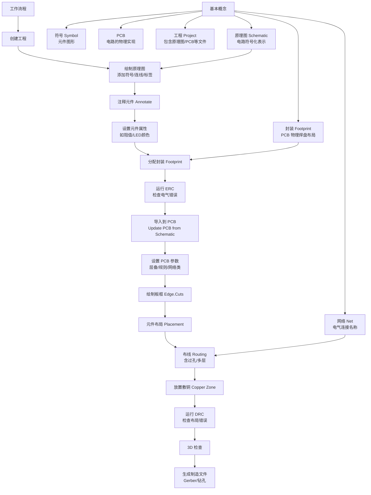

# 第一部分 KiCad简介

## 1.1 基本术语

| 术语                                    | 含义概述                                                     |
| --------------------------------------- | ------------------------------------------------------------ |
| 原理图（Schematic）                     | 由一页或多页组成的电路图集合，每个文件代表一页。             |
| 层次原理图（Hierarchical Schematic）    | 多页嵌套的原理图结构，顶层必须有根原理图；子工作表可重复使用。 |
| 符号（Symbol）                          | 原理图中的元件图形，可代表物理元件或概念性对象（如电源）。   |
| 引脚（Pin）                             | 符号上的连接点，对应物理元件的实际引脚。                     |
| 符号库（Symbol Library）                | 存储符号的集合，可在多个原理图中复用。                       |
| 网表（Netlist）                         | 原理图的连接信息表示，用于在工具间传递数据，包含网络名称和引脚连接关系。 |
| 网表文件（Netlist File）                | 网表的文件形式，但现代 KiCad 工作流程中通常不再需要手动生成。 |
| 印刷电路板 PCB（Printed Circuit Board） | 原理图/网表的物理实现，每个 PCB 文件对应一个设计。           |
| 封装（Footprint）                       | PCB 上的元件实体，包含焊盘等铜区。                           |
| 焊盘（Pad）                             | 封装中的电连接铜区，与符号引脚通过网表关联。                 |
| 图框（Drawing Sheet / Title Block）     | 原理图或 PCB 图纸的模板，包含标题栏等信息。                  |
| 绘图（Plotting）                        | 生成制造输出，如 Gerber、钻孔文件、PDF 等。                  |
| Ngspice                                 | KiCad 集成的混合信号电路仿真器，可在原理图中运行 SPICE 模型。 |

## 1.2 KiCad组件

| 组件名称         | 功能描述                                                    |
| ---------------- | ----------------------------------------------------------- |
| 原理图编辑器     | 创建/编辑原理图、运行 SPICE 仿真、生成 BOM 文件。           |
| 符号编辑器       | 创建与编辑原理图符号，管理符号库。                          |
| PCB 编辑器       | 创建/编辑 PCB，输出 2D/3D 文件，生成制造输出（如 Gerber）。 |
| 封装编辑器       | 创建/编辑 PCB 元件封装，管理封装库。                        |
| Gerber 查看器    | 查看 Gerber 和钻孔文件。                                    |
| Bitmap2Component | 将位图图像转换为符号或封装。                                |
| PCB 计算器       | 提供元件、电气间距、线宽、色环等计算工具。                  |
| 图框编辑器       | 创建和编辑图框模板（标题栏等）。                            |

## 1.3 基本概念和工作流程

# 第二部分 基本操作

## 2.1 工程

点击 **文件** → **新建工程**，浏览到你想要的位置，并给你的工程起个名字，如 "入门"。确保 **为工程创建一个新的文件夹** 复选框被选中，然后点 击**保存**。这将在一个新的子文件夹中创建你的工程文件，其名称与工程相同。

<figure style="text-align: center;">
    
    <figcaption style="font-size: 1.0em; color: #555; margin-top: 10px; margin-bottom: 5px; font-style: normal;">
        <b>图2.1 新建工程</b>
    </figcaption>
</figure>

## 2.2 原理图

### 2.2.1 符号库表设置

第一次打开原理图编辑器时，会出现一个对话框询问如何配置全局符号库表。符号库表告诉 KiCad 要使用哪些符号库以及它们的位置。如果你已经安装了 KiCad 的默认库，建议你选择默认选项。**复制默认的全局符号库表（推荐）**。

> 默认库表文件的位置：`C:\Program Files\KiCad\9.0\share\kicad\template\`

### 2.2.2 原理图编辑器基础知识

要在原理图上移动，用鼠标中键或鼠标右键点击并拖动。用鼠标滚轮或 F1 和 F2 进行放大和缩小。笔记本电脑用户可能会发现，改变鼠标控制，使其更适合于触摸板；鼠标控制可在 **偏好设置** → **偏好设置…** → **鼠标和触摸板** 中配置。

<figure style="text-align: center;">
    
    <figcaption style="font-size: 1.0em; color: #555; margin-top: 10px; margin-bottom: 5px; font-style: normal;">
        <b>图2.2 鼠标和触摸板偏好设置</b>
    </figcaption>
</figure>

### 2.2.3 原理图图框设置

在绘制原理图中的任何内容之前，先对原理图页面本身进行设置。 点击 **文件** → **页面设置**。给原理图一个标题和日期，如果需要的话，改变原理图大小。

<figure style="text-align: center;">
    
    <figcaption style="font-size: 1.0em; color: #555; margin-top: 10px; margin-bottom: 5px; font-style: normal;">
        <b>图2.3 原理图的页面设置</b>
    </figcaption>
</figure>

### 2.2.4 将符号添加到原理图中

在原理图中添加一些符号，开始制作电路。点击窗口右侧的 **添加符号** 按钮  或按`A`键，打开 `选择符号` 对话框。

从选择符号中找到电池、LED、R三个符号

